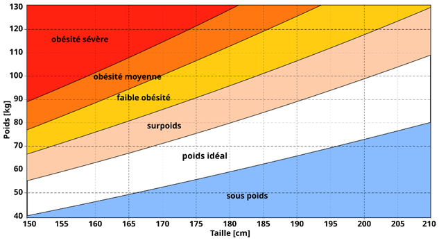

# Calculateur d'Indice de Masse Corporelle (IMC)

[](https://github.com/Nakhiru/BMI-Calculator/actions/workflows/unit-tests.yml)

## 📌 Définition du programme

Ce programme est un **module autonome** en **Python** permettant de calculer l'**Indice de Masse Corporelle (IMC)**, un indicateur permettant d'évaluer la corpulence d'un individu.

Il prend en entrée **un fichier JSON** contentant les mesures d'un ou plusieurs patient(s) et consigne les résultats datés dans **un autre fichier JSON** contenant toutes les mesures effectuées sur l'ensemble des patiens.  

## 📊 Formule de calcul

L'IMC est calculé à partir de la **taille** (en mètres) et de la **masse** (en kilogrammes) de l'individu selon la formule suivante :

$$
IMC = \frac{\text{masse} (\text{kg})}{\text{taille} (\text{m})^2}
$$

Le résultat, exprimé en **kg/m²**, permet ensuite d'évaluer la corpulence d'un individu selon le tableau suivant :

## 📋 Classification de l'IMC

| IMC (kg/m²)       | Catégorie                 |
|-------------------|-------------------------|
| **< 16.5**       | Dénutrition              |
| **16.5 - 18.5**  | Maigreur                 |
| **18.5 - 25**    | Poids normal             |
| **25 - 30**      | Surpoids                 |
| **30 - 35**      | Obésité modérée          |
| **35 - 40**      | Obésité sévère           |
| **≥ 40**         | Obésité morbide          |



## 🏥 Remarque importante

Cet outil permet de **suivre l'évolution de la corpulence** d'un individu, mais ne constitue cependant pas un avis médical fiable en soit:
L'IMC ne prend pas en compte certains facteurs comme la **sportivité** ou encore l'**âge** de l'individu, ce qui peut parfois conduire à de mauvaises interprétations.

---

## 🎯 User Story

> **En tant que** fournisseur de données sanitaires,  
> **Je veux** calculer et consigner l’Indice de Masse Corporelle (IMC) de mes patients,  
> **Afin de** leur fournir des données pertinentes ainsi qu’une catégorisation de leur corpulence et d’en suivre l’évolution.

## Critères d'acceptation

1. ✅ Les **données d’entrée sont vérifiées et validées**  
2. ✅ Les **données d’entrée sont fournies via un fichier JSON**  
3. ✅ Les **données de sortie sont consignées dans un fichier JSON et sont datées**  

---

## 🖥️ Implémentation Technique

- Langage: **Python 3.11**
- Framework de test: **unittest**
- Environnement: **python:3.11-slim** (Docker)

### Installation et utilisation

1. Cloner le repo git
2. Se déplacer dans le projet: ```cd .\BMI-Calculator\```
3. Build l'image Docker: ```docker build -t bmi-calculator .```
4. Run le projet en fournissant le fichier d'entrée: ```docker run -v "$(pwd):/app" bmi-calculator input.json```

### 📌 Accéder au rapport de test sur GitHub Actions

1. Cliquez sur l’onglet "Actions" de votre dépôt GitHub.
2. Dans la colonne de gauche, sélectionnez le workflow "Run Test" pour afficher les exécutions.
3. Choisissez un workflow run spécifique dans la liste.
4. Cliquez sur le job correspondant, comme "Run Tests".
5. Dans les logs, ouvrez la section "Run Tests" pour afficher les détails.
6. Vous verrez alors tous les tests effectués ainsi que leur statut (réussite ou échec). ✅❌
